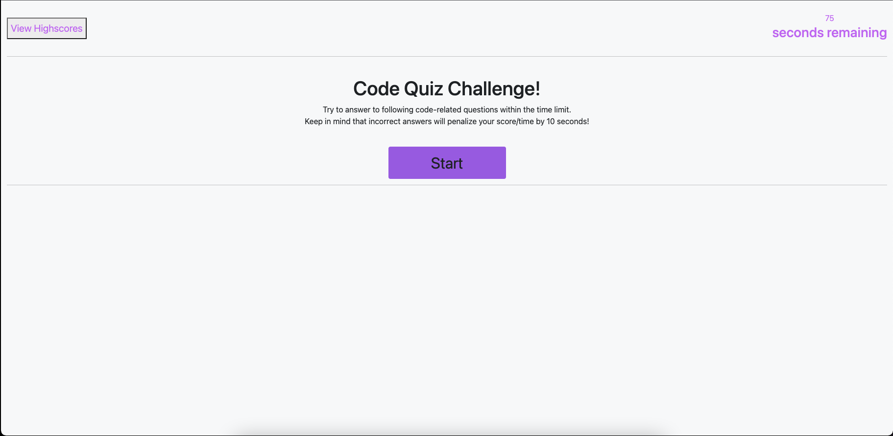
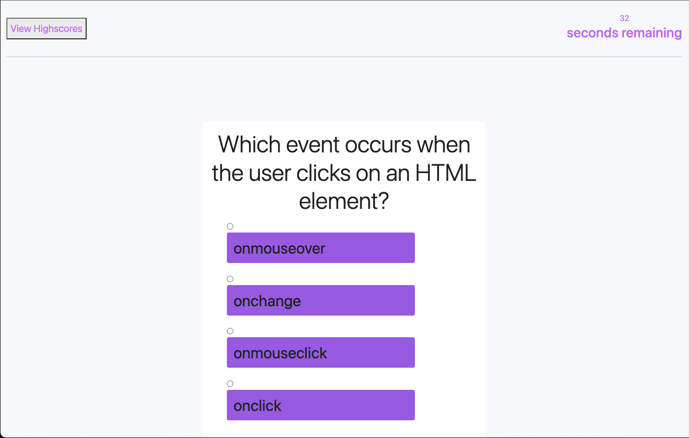
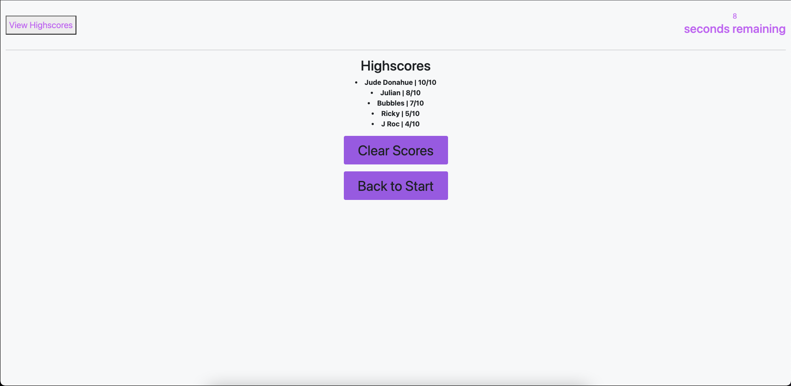

# <Code-Quiz-Challenge>

## Description

The focus of this challenge was to demonstrate and apply my knowledge of JavaScript to build a functional and interactive UI that makes use of DOM manipulation and localStorage to provide a seamless and foolproof user experience.

## Installation

https://judemdonahue.github.io/Code-Quiz-Challenge/

## Usage

## License

Refer to license listed in repository (MIT License) 

## Badges

